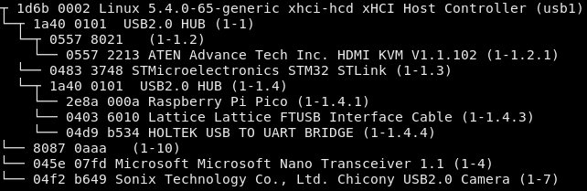

# lsusbtree
A tool that prints out your USB devices (including manufacturer and product info) in a tree format. Think of it like `lsusb -t`, but useful.

It reads your USB devices from `/sys/bus/usb/devices`, so it currently only supports Linux.

## Sample output
