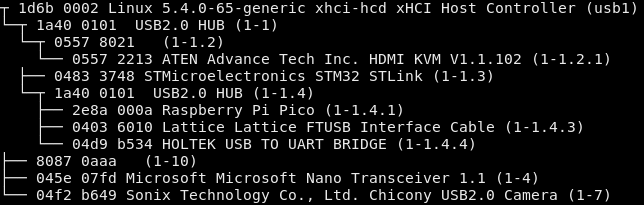

# lsusbtree
A tool that prints out your USB devices (including manufacturer and product info) in a tree format. Think of it like `lsusb -t`, but useful.

It reads your USB devices from `/sys/bus/usb/devices`, so it currently only supports Linux.

## Sample output

## TODO
* Give the option to read from `usb.ids` instead of the manufacturer/product descriptors
* Display speed (low, high, full, super, super+) for each device (or, if that's not possible, at least the version: 1.0, 2.0, 3.0, etc)
* Handle blank manufacturer/product descriptors better